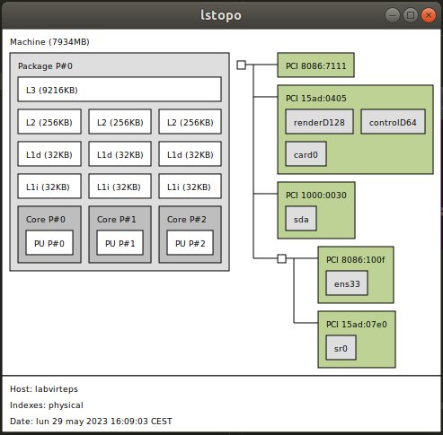
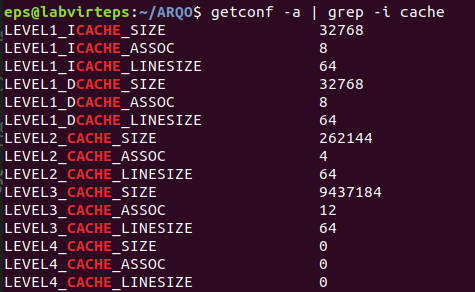
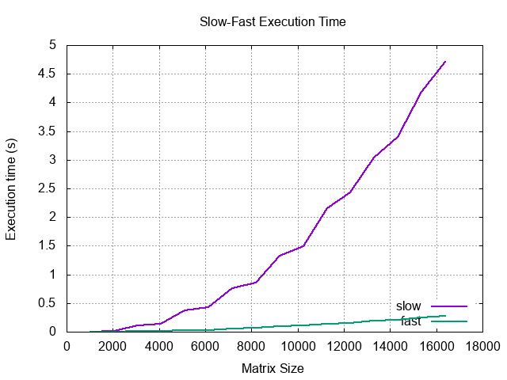
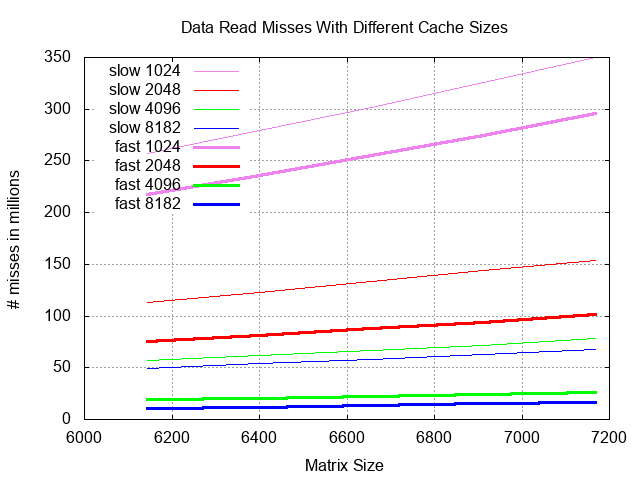
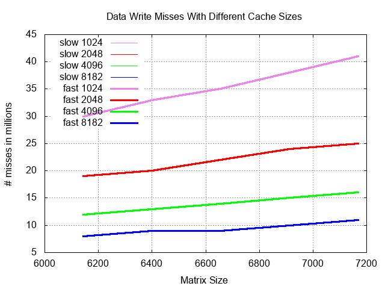
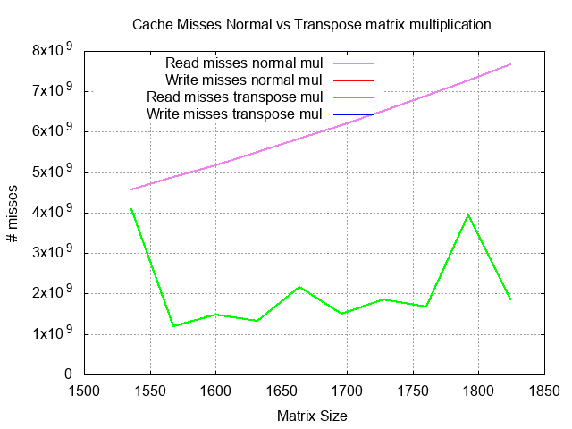
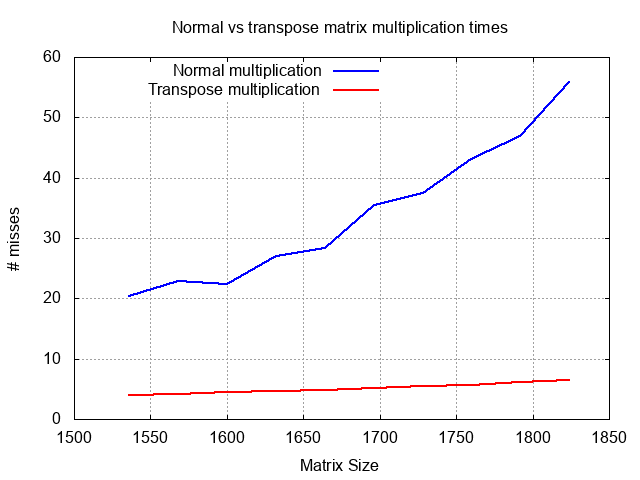

# Practica 3: Cache

For this lab, I will be using my personal computer with a VM with Ubuntu 18.04 (lab image), 3 cores and 8 GB RAM.

## Exercise 0

As we can observe in the next image, we have 3 cache levels (and their size), of which only the level 1 is separated between data and instructions.

(Fig. 0.1)

Using `getconf -a | grep -i cache` we can now observe that the cache is set as associative, we can also observe the ways (LEVEL_CACHE_ASSOC) and the line (block) size:

(Fig 0.2)

## Exercise 1

For this exercise we follow the execution pattern showed in the pdf of slow N1, slow N2, fast N1, fast N2 repeated 10 times. This is necessary since the operative system will cache results of executing the program, which would cause the program to execute faster if using the same arguments multiple times in a row. We also need to make an avergae of multiple execution times since 1 execution time could be drastically changed for any external reasons causing it to not represent the real time it should take.

In the next image we can observe the result of exedcuting the program 10 times and the average time each matrix size took:

(Fig. 1.1)

The difference in execution time is caused by the way the memory stores the matrix, which is by rows. The slow method accesses the values by columns, which results in way more cache misses than the fast method, which accesses values by rows. Misses mean I/O which increases execute time a lot.

## Exercise 2

\(Fig. 2.1)

\(Fig. 2.2)

As we can observe in fig 2.1, the number of misses increases both with the size of the matrix and in the slow (inefficient) way. This makes sense since the matrix data is stored by rows and the slow method accesses data by columns. This causes the cache to not have the desired block more often.

For the fig. 2.2, both slow and fasst methods cause the same misses, this is because both methods write to the memory similarly.

## Exercise 3

\(Fig. 3.1)

\(Fig. 3.2)

As expected the misses and time for the transpose multiplication are better than the normal multiplication. This is caused by the way array data is stored in the cache, which is by rows. So by using the transpose multiplication (row x row) we take more advantage of the cache causing less misses which also means better execution times.