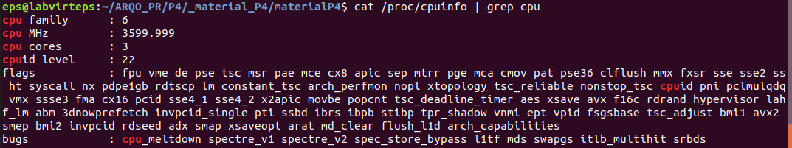
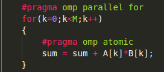
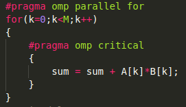
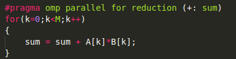
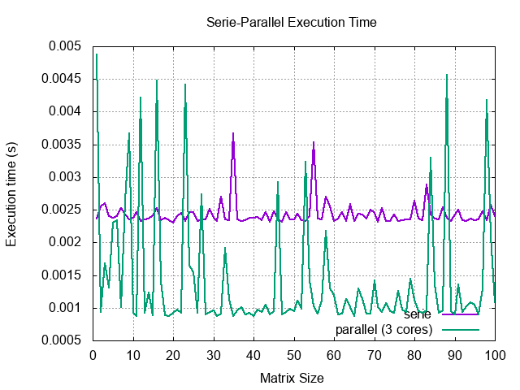

# Practica 4: Modern Architectures

## Exercise 0

For this assignment I will be working on a vm on my personal computer with 3 cores assigned.

As we can observe in the following image, we have 3 cores at 3.6 GHz, with hyperthreadding activated (ht appears in flags).

(Fig. 0.1)

## Exercise 1

1. Yes, we can launch more threads than CPU cores, but having too many threads causes a loss of efficiency because now the OS needs to manage all these threads with locks and other resources (plus overhead) instead of just letting a thread run in a core.

2. I can't check the lab PCs or the cluster since I'm working from home, but for my own PC in this VM it would be 3.

3. The priority is num_threads() > omp_set_num_threads() > OMP_NUM_THREADS, we can observe this by using all 3 options and executing the program, which will then print the num_threads().

4. When we declare a variable as private or firstprivate, new space is allocated for it in memory (new pointer) and its value, when changed, will not be shared between threads.

5. The private variable will see its value reset to 0 (case integer) and the first private keeps its value.

6. The private and first private variables, when the region ends, will return to their previous pointer and value.

7. Public variables keep their value and pointer all through the region and also keep their values after this region ends, sharing this value between threads.

## Exercise 2

1. Since the vectors generated contain all 1s, the result should be the size of the arrays.

2. The result for the current parallelized code is not correct. We can observe that the result is usually a third of the desired result and if we change the number of threads to 2, the result changes to half of the desired value. This could mean that the threads are not sharing correctly the sum.

3. Using both of these pragmas as shown in the next images, returns the correct result, but the execution time is increased (being the atomic pragma a bit faster).

4. This option's code is shown below. This is by far the best option, getting times up to 50 times faster than the past pragmas with a correct result.

    

5. To find the threshold I decided to plot the execution times of both the pescalar_serie and pescalar_par3 methods with varying matrix sizes and 10 iterations per size. The result is that the threshold should be around 300k: 

## Exercise 3

