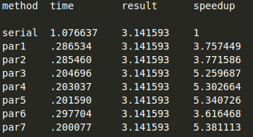

# Practica 4: Modern Architectures

## Exercise 0

For this assignment I will be working on a vm on my personal computer with 3 cores assigned.

As we can observe in the following image, we have 3 cores at 3.6 GHz, with hyperthreadding activated (ht appears in flags).

(Fig. 0.1)

## Exercise 1

1. Yes, we can launch more threads than CPU cores, but having too many threads causes a loss of efficiency because now the OS needs to manage all these threads with locks and other resources (plus overhead) instead of just letting a thread run in a core.

2. I can't check the lab PCs or the cluster since I'm working from home, but for my own PC in this VM it would be 3.

3. The priority is num_threads() > omp_set_num_threads() > OMP_NUM_THREADS, we can observe this by using all 3 options and executing the program, which will then print the num_threads().

4. When we declare a variable as private or firstprivate, new space is allocated for it in memory (new pointer) and its value, when changed, will not be shared between threads.

5. The private variable will see its value reset to 0 (case integer) and the first private keeps its value.

6. The private and first private variables, when the region ends, will return to their previous pointer and value.

7. Public variables keep their value and pointer all through the region and also keep their values after this region ends, sharing this value between threads.

## Exercise 2

1. Since the vectors generated contain all 1s, the result should be the size of the arrays.

2. The result for the current parallelized code is not correct. We can observe that the result is usually a third of the desired result and if we change the number of threads to 2, the result changes to half of the desired value. This could mean that the threads are not sharing correctly the sum.

3. Using both of these pragmas as shown in the next images, returns the correct result, but the execution time is increased (being the atomic pragma a bit faster).

4. This option's code is shown below. This is by far the best option, getting times up to 50 times faster than the past pragmas with a correct result.

    

5. To find the threshold I decided to plot the execution times of both the pescalar_serie and pescalar_par3 methods with varying matrix sizes and 10 iterations per size. The result is that the threshold should be around 300k:

## Exercise 3

From this exercise o, I will give the VM 6 cores instead of 3.

1. As we can observe on the tables above, the method with the worst method is the inner-most parallelization, a reason may be because that loop is repeated more times than the outter ones, which would cause more creation or beggining of threads resultin in an increase of execution time.

2. If my previous reasoning is correct, then the coarse-grained parallelization would be better for every algorithm, but there may be a case where the fine-grain is better, i can't know for sure.

3. Observing the images below, i looks like the speedup kind of stabilises after matrix size 800\
\
\
The plot for the execution time of the serial method follows an N³ trend because the algorithm is formed by 3 nested for loops each from 0 to N. Also expected is that the parallelised method works much faster than the serial. 

## Exercise 4

1. For the serial version, 100 million rectagles are created, which means h is 1/100.000.000

2. As observed on the table below, the fastest methods are 3,4,5 and all of them gave the correct result:\

3. Declaring it as a firstprivate causes its pointer value to change, but after the pragma region ends, and its pointer value is restored, the values of the array can still be reached, I can only assume this is due to its pointer nature. I wouldn't think it makes much sense to make it private because you need to access the values after the region ends, but apparently making it a pointer solves that.

4. I believe that par1 has worse performance that par3 because of the "false sharing". False sharing causes a shared content to be marked as invalid when modified by a thread which causes an more accesses to memory. par3 avoids this by using "padding", which separates the indexes of the shared array. Par3 avoids this problem by adding everythin in its own private variable and adding the results of each thread at the end, only needing to shar variables at this final stage.

5. Critical is used in the pi_par5 to ensure that theree is no concurrent access to the pi variable since the default value for variables was set to shared. This should cause some drop in performance, but it ensures that the result is correct, which is fundamental.

6. Pi_par6 has close to the worst performance measured, this is probably a similar problem than with par1 as mentioned in question 4 causing false sharing.

7. I believe the optimal method is par5 which uses critical instead of an array like par4 using less memory and ensuring the correctness of the sum.

## Exercise 5

1. This loop is not a good idea for parallelization, as mentioned, with bigger pictures a lot of memory is needed so a segment violation could even happen.

2. Yes there are loops that suffer from this suboptimal ordering. Around line 165, the RGB loop should have the (j, height) in the outter loop so we access the pixels by rows not columns:\
\
Same for the loops at line 180, line 206 and line 233 (similar to 206):\
\
\
In all of these cases, data was being accessed by columns instead of rows. A partial row was being loaded to cache from memory, 1 column was being read, and the next row was solicited. With the new changes, we load 1 row, read all data from that row, the ask for the nex row. Just with these changes we reduced the time from 7.5 to 4.5 seconds for the processing of an 8k image.

3. Following what we haveve learnt from previous exercises, we tried adding `#pragma omp parallel for` to various outter loops. Loop 1 -> line 21, Loop 2 -> line 180, Loop 3 -> line 210, Loop 4 -> line 237\
\
For the loop 1, we also applied reduction to the sum variable as seen on the matrix multiplication.\
Loop 2 stays the same.\
Loop 3 and for benefit greatly bt setting the variables used as private.\
\
 
4. Not fitted for live 8k live video yet >:(

5. \
